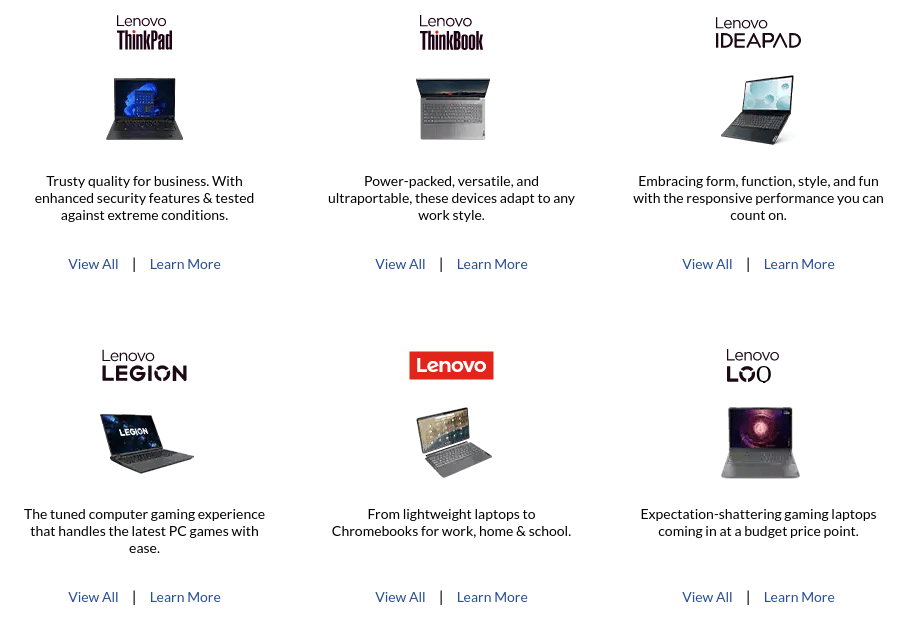
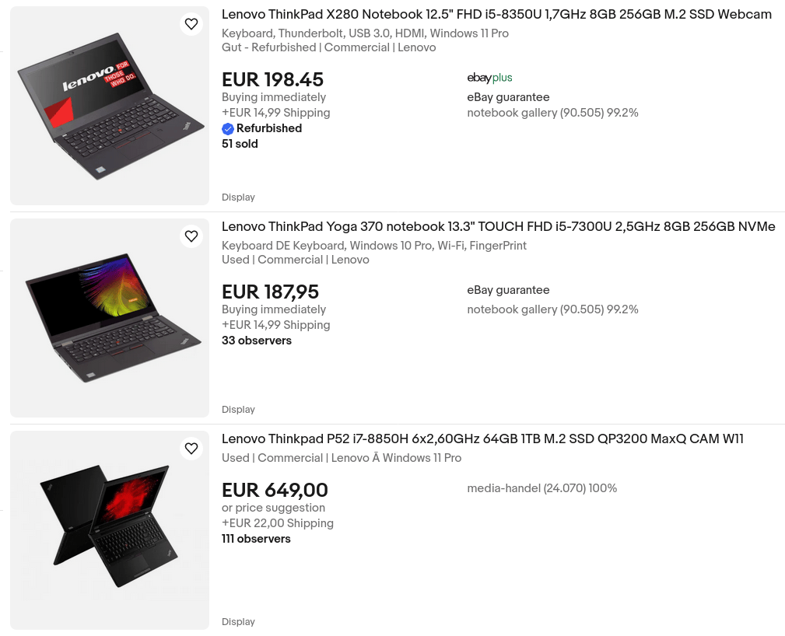
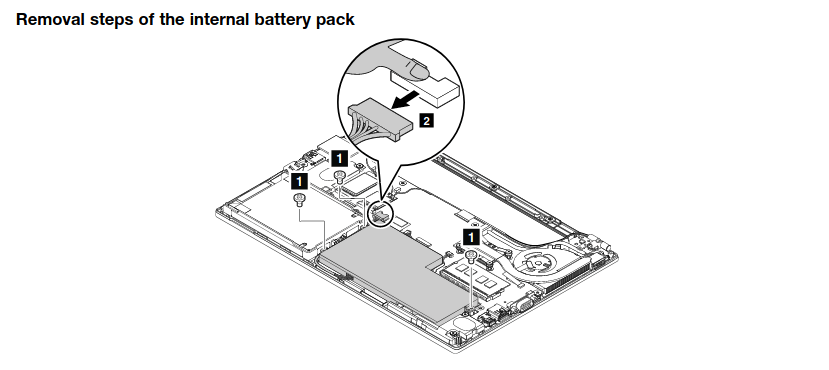
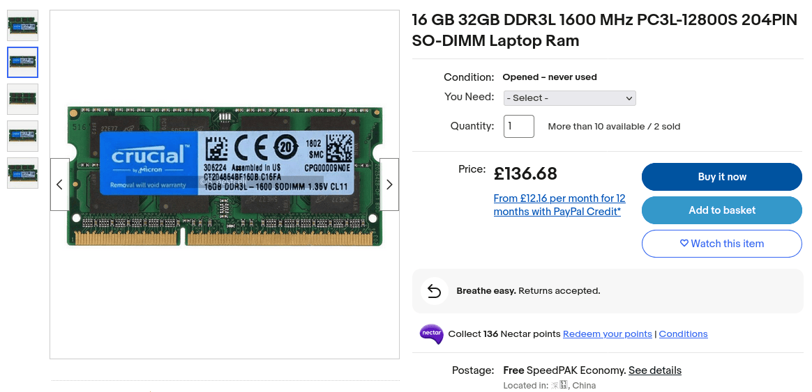

+++
title = "ThinkPad X250 - The laptop in the world"
description = "Why ThinkPads are appealing, why I bought one, and why I grew to dislike it."
updated = 2024-01-18
draft = true
+++

The world of laptops is confusing and filled with compromise. Laptops offer variety, personalisation, and configuration akin to almost no other *everyday* electronic product. This often makes it difficult to make a satisfying decision. Choosing between two things is somewhat easy, but when you are presented with many choices [analysis paralysis](//wikipedia.org/wiki/Analysis_paralysis) can settle in.

<!-- more -->

⚠️ *This post is subjective! Personal opinion and hyperbole abound!*





Lenovo runs 7 lines of laptops, each usually containing several sub-lines. Similarly, Dell lists 10 lines of laptops on their website. HP lists 12. MSI 10. Each line offers hardware configuration to some degree. Each with a different price range. All offering their own unique combination of pros and cons. Comparing between all these options can be exhausting. Even if you decide on a specific brand, you still need to examine marketing lingo, learn about their specifications and testing[^1], and read third-party reviews before making a final decision.





So when you hear a group of people shouting "Just buy a used ThinkPad!", offering good bang for your buck, dedicated community support, and brand dogma to boot, you come running... *mostly* out of desperation.

## Use case

This is a good time to talk more about the way I use my laptop. I work remotely, usually doing web development but also design and UX work. I tend to work from home, but I switch around from desk to living room to kitchen often, and I have *at least* a day a week when I like to work outside, in the city.





There is a variety to my work; sometimes the particular software I am working on is quite efficient and light on processors, yet other times I need to compile heavy codebases that can stress just about as much as you throw at them. I also do not make a distinction between a work laptop and a home laptop, I use one for both. I try to organize it in such a way that there is a clear line in the actual software I use. Profiles and containers on Firefox and workspaces on the desktop help. This also means I enjoy taking the laptop with me to the couch, or the bed, or using it as a cooking aide in the kitchen.

I want my laptop to be with me wherever I go, almost like a phone, being able to be used whenever.

## Gateway

In early 2021 I found myself needing a smaller and more portable laptop. ThinkPad laptops were mentioned often in the communities I frequent online, I saw them being used by people on train rides, in offices, and around media in general. I was enamoured with the community's focus on sustainability and future proofing. I also had an aversion to spending "significant" money on... anything. In the laptop world, this boils down to buying chromebooks or secondhand. Since the ThinkPad community got to me, I went with the latter.


 


When push came to shove, I made the decision to buy one and fairly quickly found an enticing offer for a used [ThinkPad X250](//www.notebookcheck.net/Lenovo-ThinkPad-X250-Ultrabook-Review.136646.0.html) from 2015. I am not entirely sure how I ended up deciding on a ThinkPad X250, in hindsight it was not the right laptop for me, but it likely had to do with dumb-luck matching recent Reddit posts about the X-series laptops with an eye-catching offer on eBay.

The laptop featured an Intel i5-5300U CPU, no dedicated GPU, a 1366x768 TN panel, and a bona-fide 500GB HDD for a low price of 90 GBP (114 USD, 105 EUR). A downgrade in raw processing power to be sure, but an upgrade in portability, maintainability, repairability, and all the other *-bilities* you can think of! I was entirely convinced, I had to have it.

The purchase was made and a little while later I received my machine in the post.

## Infatuation

It was love at first sight. The X250 was *significantly* smaller than my previous laptop, it boasted a functional yet pretty aesthetic, touchpad buttons, a great keyboard. Not a single flaw to be found. The laptop was cheap, everyone online praised me on my new "buy it for life" item, people around me were curious about it, I was the centre of attention and there was nothing to dislike.

In a world where new laptops are coming with [dual-screens](//www.asus.com/laptops/for-home/zenbook/asus-zenbook-duo-2024-ux8406/), [foldable screens](//www.lenovo.com/us/en/thinkpad-x1-fold/), or [no screens at all](//product.sightful.com/), it can feel refreshing to own such a simple one. No tricks and *secrets* here!





I did have to tinker with it to bring it up to better standards. The beauty of the ThinkPad brand, after all, is that you *can* open it and upgrade it! I dismantled the laptop, replaced the hard drive with a new SSD, and assembled it back together. Later, I dismantled it again, upgraded the WLAN card, and assembled. Dismantled it, used fresh thermal paste, assembled it. Dismantled, added an internal battery, assembled. Dismantled, added an m.2 drive, assembled.

This on and off assembly line continued for a little while, I was learning what pieces of the hardware I can rip out and replace without repercussions. At the same time I was learning how everything worked, what makes one model of a WLAN card more appealing to the other and why I would care to replace it.

It was a state of pure bliss. I could have almost written "Zen and the Art of ThinkPad maintenance"[^2]. Regardless, issues did pile on but there was nothing I could not fix or overcome. Month after month, no matter how annoying, troubles with the laptop tended to go away.

I could see years into the future, everyone would be wasting money on buying laptops year after year and I would be here, with my X250, upgraded and maintained well into **2030!** The dream was coming true, a laptop that is *universally* great.

Truthfully speaking, I was simply *getting used to living with the issues.*

## Hard truths

Only recently did I begin to sober up to the truths of owning a 5-year-old laptop. From the very beginning, I have been dealing with compromise after compromise.

I started to face the fact that I have been adapting my life around *it*, instead of the other way around. How many online meetings did I leave early because the noise of the fan was unbearable? How many times have I avoided leaving the house because the laptop was *only at 50% battery* and wouldn't last me long enough to get some work done? How many clients did I lose because I was not able to efficiently work on their codebases?

It was obvious in hindsight, how could you believe that a laptop designed for office use in 2015 would suffice a developer's workload well into the 2020s? I grew steadily less zealous towards ThinkPad as a brand and old Lenovo laptops as anything beyond a hobby project.

The bitter annoyances of dealing with this machine grow bolder and bolder. It just gets too hot. The sound is awful. I could hear the fan all day long. Compiling software takes hours.

Was everyone online lying, or did I hold unrealistic expectations? If this laptop works for everyone else, what was I doing wrong? In reality, if you look past the universal acclaim on Reddit posts and delve a bit deeper into the narrative of comments on HackerNews you will see people who disagree with the status quo. Not everyone is as enthusiastic about the VGA ports, the smart card readers, or the bulky hot-swappable 72Wh+ batteries.

## So-called "upgradability"

This was also the moment to accept that older ThinkPad "upgradability" is looked at with extremely rose-tinted glasses. A laptop, and in this case my X250, has several important components: a motherboard, a CPU, sometimes a GPU (not accounting for the iGPU), RAM, a screen, and some storage. These are technologies that age, some slower than others, and eventually need to be updated.

So *which* of these important components are upgradeable?

The motherboard, put simply, is unlikely to be upgradable. As with most laptops its shape, size, and I/O are all designed for its specific chassis. There has been some alleged success in upgrading to the X260 motherboard, a 2016 model, but this is not a common DIY upgrade. Even if it were, the upgrade in processing power would be welcome but not ground-breaking[^3].

The CPU is linked to the motherboard via BGA, soldering a new CPU onto a motherboard is out of reach for most hobbyists even with proper equipment. Upgrading the GPU is linked directly with the CPU as there is no dedicated GPU on this laptop, even if it were there the chip would be soldered and very difficult to upgrade in any meaningful way.





RAM is a touchy subject, ThinkPad lovers *hate* soldered RAM. The sole mention of soldered RAM modules is enough to dissuade people from even contemplating the purchase of a laptop. This 2015 ThinkPad had the possibility of having 16GB of DDR3 1600mhz RAM from the factory. Most configurations are 8GB, with some at 4GB. It is not exactly rare to see a 16GB configuration online but it is much tougher to find one at a great deal price, especially today.

Well, so what is the big deal just buy an 8GB or 4GB model and upgrade to 16GB. Since it is not a soldered model, you can just slot a 16GB module in and be done! Good luck finding one, and good luck not paying over 100 EUR (109 USD 86 GBP) for it. DDR3 modules were already at downfall in 2015[^4], and in 2023 they are getting rarer and rarer. A single stick of 16GB DDR3L RAM is not easy to come by.

The screen is upgradable. Order a new panel from AliExpress, open your laptop, pop it in, and there you go. You have yourself a 4k UHD IPS panel in your 2015 laptop. It will set you back another 80-100 euro, it will drain more energy than your previous screen, and it has a chance not to fit in your laptop at all thanks to "or compatible model will be sent" sellers but it will certainly look *almost as good* as mid-tier machines from any major manufacturer in the last few years.

## Conclusion

To put it all together, I believe open and tinker-able hardware has a place in the world and I would never want to see it disappear. However, I believe what constitutes open hardware will change over time as tooling and knowledge about it becomes more widespread. 

My ThinkPad X250 is a weird, quirky, and wonderful machine. Older (4+ years?) secondhand ThinkPads are a great way to provide computing to households for cheap. Families that need a way online, without the fuss and without spending a lot of money, have a great opportunity in these types of machines.

They are not perfect, and people who fight tooth and nail for them should take an honest look at the surrounding competition. It is better to admit they are hobby machines that have a lot to teach than to lie and say they are for everyone.

I doubt I will be recommending a secondhand ThinkPad produced prior to 2020 to anyone that needs a no-frills day-to-day laptop. My next laptop, not a ThinkPad, is on its way to me and I hope I can write something similar, warts and all, about it as well.

**Footnotes**

[^1]: Apple's "unified memory" or "liquid retina" are examples of jargon that can be hard to understand. Other specifics such as battery life, processor TDP, even screen contrast are measured by manufacturer-specific processes that differ from each other.

[^2]: "Zen and the Art of Motorcycle Maintenance" by Robert Pirsig explores themes that the ThinkPad community would resonate with.

[^3]: An X260 motherboard comes with DDR4 RAM support and a 6th generation CPU but drops the beloved VGA port. This upgrade would buy you more time with the machine to be sure, but still steadily behind equivalent modern machines.

[^4]: Many manufacturers have already ended production of new DDR3 SDRAM modules as of 2024, but a few still maintain production mostly for server usage. SO-DIMM is difficult to come by.